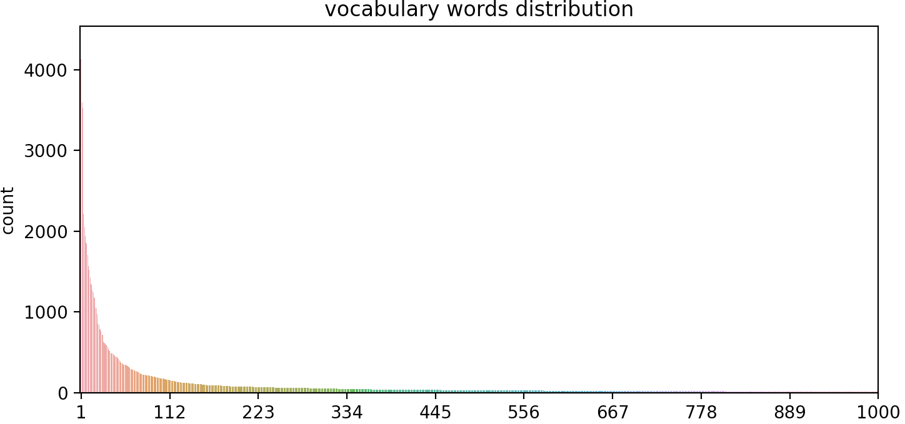

# N-gram models for language modeling

We simply built n-gram models which are simple baseline language models. More precisely we built **bigram** and **trigram** models. Raw n-gram models cannot be evaluated on a test set as they overfit training text data too much. Hence it is required to use a **smoothing** technique (regularization). We chose an intuitive one by computing the **convex mixture** between an ngram model and the **uniform** distribution over vocabulary as the convex mixture of probability distributions remain a probability distribution.

As for dataset we simply used the book **Pride and Prejudice** of Jane Austen which appears to be the most downloaded ebooks from [Gutenberg project](https://www.gutenberg.org/ebooks/search/%3Fsort_order%3Ddownloads). 

We then performed 2 tasks:
  - language model **evaluation** by computing **perplexity** on test set
  - **text generation** using raw bigram model

## Dataset

**Data**: ebook Pride and Prejudice by Jane Austen

<p align="center">
  
</p>

**Training**: 60 first chapters roughly 125 000 tokens

**Test**: last chapter roughly 1250 tokens

## Vocabulary

We considered the **1000 most frequent words** to buid our vocabulary. Those which were not among them were considered as being out of vocabulary and replaced by <OOV> token in data set. Hence we had 13.1% of OOV words among whole data set. 
  
Without surprise we can observe Zipf's law on the plot of word frequencies.

<p align="center">
  
</p>

## Preprocessing

**Raw data sample**:
```
      “How so? How can it affect them?”

      “My dear Mr. Bennet,” replied his wife, “how can you be so
      tiresome! You must know that I am thinking of his marrying one of
      them.”
```

We only performed basic NLP preprocessing as we want to be able to generate text properly. Although using stemming or/and lemmatization could have helped us to 'absorb' more words into our vocabulary.

**Training data sample**:
```
<S> how so how can it <OOV> them </S> <S> my dear mr bennet replied his wife how can you be so <OOV> you must know that i am thinking of his marrying one of them </S>
```
## Models

Here is the list of models we designed:

## Evaluation

## Text generation


