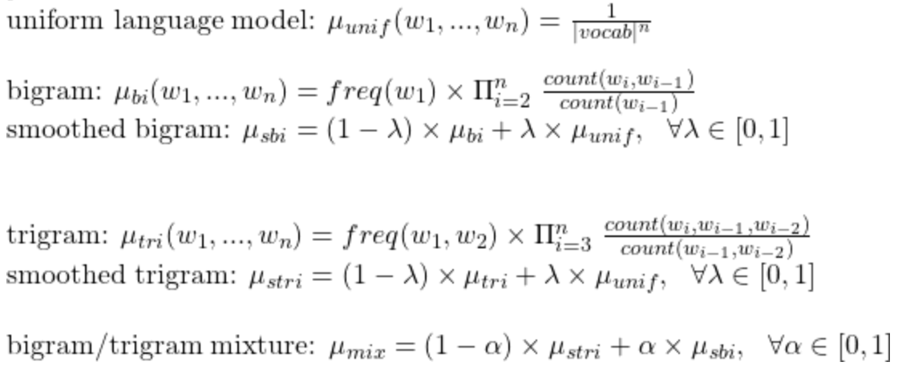
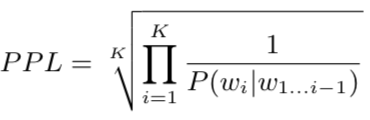
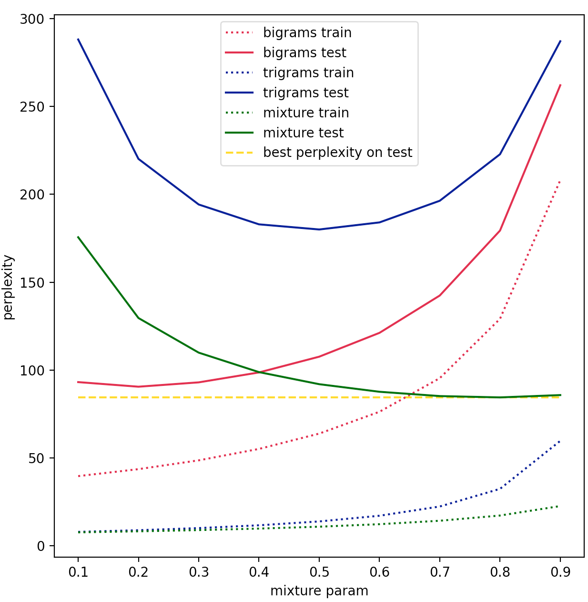

# N-gram models for language modeling

We simply built n-gram models which are simple baseline language models. More precisely we built **bigram** and **trigram** models. Raw n-gram models cannot be evaluated on a test set as they overfit training text data too much. Hence it is required to use a **smoothing** technique (regularization). We chose an intuitive one by computing the **convex mixture** between an ngram model and the **uniform** distribution over vocabulary as the convex mixture of probability distributions remain a probability distribution.

As for dataset we simply used the book **Pride and Prejudice** of Jane Austen which appears to be the most downloaded ebooks from [Gutenberg project](https://www.gutenberg.org/ebooks/search/%3Fsort_order%3Ddownloads). 

We then performed 2 tasks:
  - language model **evaluation** by computing **perplexity** on test set
  - **text generation** using raw bigram model

## Dataset

**Data**: ebook Pride and Prejudice by Jane Austen

<p align="center">
  
</p>

**Training**: 60 first chapters roughly 125 000 tokens

**Test**: last chapter roughly 1250 tokens

## Vocabulary

We considered the **1000 most frequent words** to buid our vocabulary. Those which were not among them were considered as being out of vocabulary and replaced by <OOV> token in data set. Hence we had 13.1% of OOV words among whole data set. 
  
Without surprise we can observe Zipf's law on the plot of word frequencies.

<p align="center">
  
</p>

## Preprocessing

**Raw data sample**:
```
      “How so? How can it affect them?”

      “My dear Mr. Bennet,” replied his wife, “how can you be so
      tiresome! You must know that I am thinking of his marrying one of
      them.”
```

We only performed basic NLP preprocessing as we want to model language properly.

**Training data sample**:
```
<S> how so how can it <OOV> them </S> <S> my dear mr bennet replied his wife how can you be so <OOV> you must know that i am thinking of his marrying one of them </S>
```
## Models

Here is the list of models we designed:

<p align="center">
  
</p>

## Evaluation

We used perplexity which is the usual metric to evaluate language models, whose formula is the following: 
<p align="center">
  
</p>

| Model | Mixture parameters | Perplexity on train set | Perplexity on test set |
| --- | --- | --- | --- |
| Smoothed bigram| lambda = 0.2 | 44 | 91 |
| Smoothed trigram| lambda = 0.5 | 14 | 180 |
| bigram/trigram mixture | lambda = 0.2, alpha = 0.8 | 17 | 84 |

<p align="center">
  
</p>


## Text generation

**sample of generated text**:

```
<S> i cannot bear to speak with the <OOV> must be <OOV> by <OOV> for myself with grateful respect towards anybody connected with his sister and with more <OOV> than i <OOV> said in a tone which had always <OOV> about him </S> <S> </S> <S> oh my dear father i <OOV> other <OOV> elizabeth hoped it might <OOV> <OOV> you may suppose of my <OOV> till <OOV> put an end to by any <OOV> appearance of composure elizabeth merely <OOV> but though not in her little <OOV> <OOV> and the evening would <OOV> have been a <OOV> of
```
**sample of generated text**:
```
<S> upon my word sir cried elizabeth </S> <S> oh dear yes but <OOV> imagine it was not able to <OOV> that his character for it however at her entrance she was reading a <OOV> excuse for not having done thus much there is no <OOV> to be <OOV> near the <OOV> that you <OOV> were removed and the <OOV> of some one else elizabeth at that moment i may <OOV> his mind was not <OOV> a kind to make his <OOV> to charlotte’s first <OOV> is ever to see many young men too that she had
```

